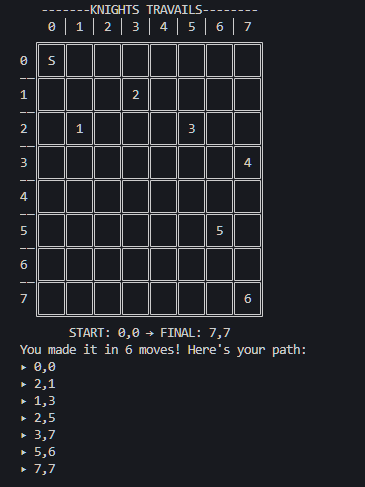

# TOP Knights Travails
A knight in chess can move to any square on the standard 8x8 chess board from any other square on the board, its basic move is two steps forward and one step to the side or one step forward and two steps to the side.

## Function
 `knightMoves(start, final, printBoard, printGraph)` shows the shortest possible way to get from one square to another by outputting all squares the knight will stop on along the way.
 ## Parameters
- `start` this is the startup array, it must have a range from 0 to 7 in the format: *[row, column]*.
- `final` in this entry specify the final position, it must have a range from 0 to 7 in the format: *[row, column]*.
- `printBoard` *(Optional)* If you want the dashboard to be displayed, specify `true`.
- `printGraph` *(Optional)* If you want the graph to be displayed, specify `true`.